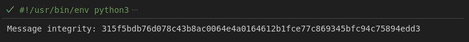

## EPSIntegrityAlgorithm
Algorithm EIA  (EPS Integrity Algorithm)

***Le processus d'intégrité en LTE utilise un algorithme d'intégrité EPS (EPS Integrity Algorithm) qui a un identifiant de 4 bits. Des exemples d'algorithmes EIA incluent SNOW et AES. Ceux-ci sont mis en œuvre dans l'UE et l'eNB pour la protection de l'intégrité de la signalisation RRC***

### Definition notre fonction de hachage

```python
import hashlib

def calculate_integrity(message):
    # Calculer le hachage SHA-256
    sha256_hash = hashlib.sha256(message.encode()).hexdigest()
    return sha256_hash
```
***la fonction `hashlib.sha256()` est utilisée pour calculer le hachage SHA-256 du message. La méthode `hexdigest()` est utilisée pour obtenir la représentation hexadécimale du hachage résultant.***

### Exemple d'utilisation

```python
message = "Hello, world!"
integrity = calculate_integrity(message)
print("Message integrity:", integrity)
```
La sortie de Hello, word


***Il est important de noter que cet algorithme d'intégrité ne fournit pas d'authentification, mais seulement la capacité de détecter les changements dans le message.***